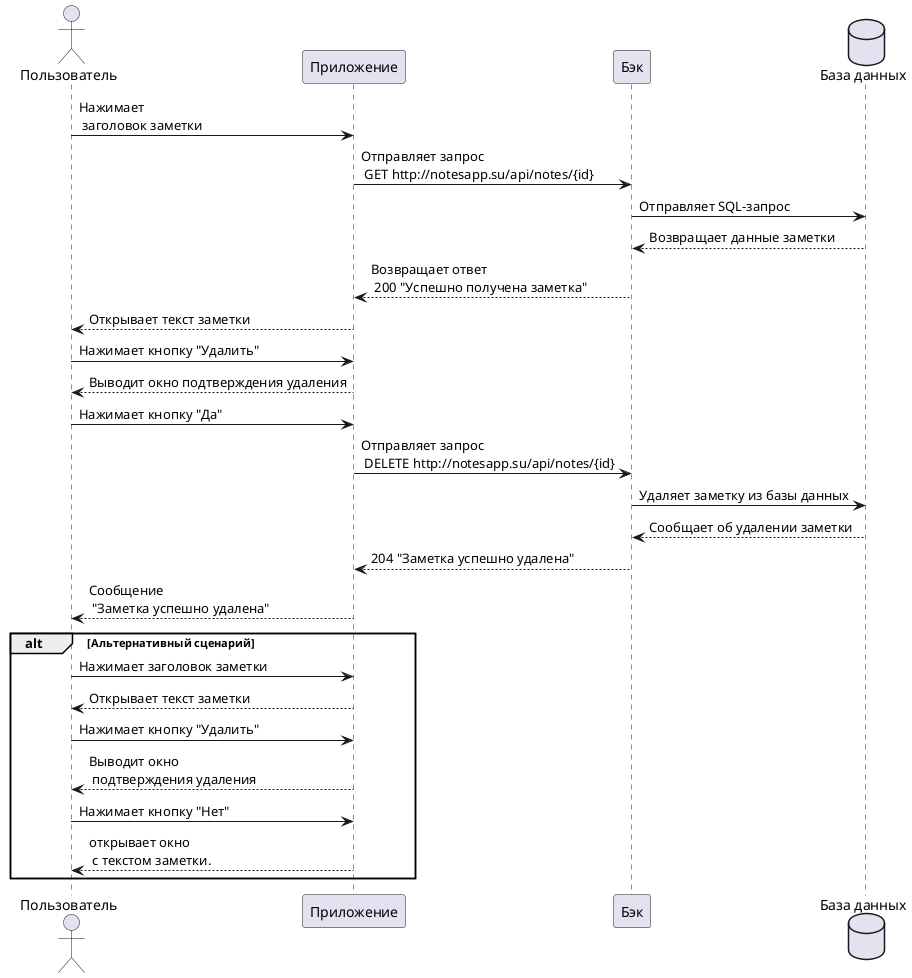

---
tags:
  - notsapp
---

# Пользовательский сценарий «Удаление заметки»

--8<-- "source:note"

### Действующие лица:

1. Пользователь

2. Приложение

3. Бэк

4. База данных

### Предварительные условия

1. Пользователь должен находиться на главном экране.

2. В программе должна быть хотя бы одна заметка.

### Выходные условия

Выбранная заметка больше не присутствует в системе.

### Основной сценарий

1. Пользователь нажимает на заголовок заметки в списке заметок.
   
2. Приложение отправляет запрос `GET http://notesapp.su/api/notes/{id}` Бэку на открытие заметки.

3. Бэк отправляет SQL-запрос в Базу данных. 

4. База данных возвращает Бэку данные заметки.

5. Бэк возвращает приложению ответ 200 "Успешно получена заметка".

6. Приложение открывает Пользователю окно с текстом заметки.
  
5. Пользователь нажимает кнопку **Удалить**.
  
6. Приложение выводит окно подтверждения удаления.
  
7. Пользователь нажимает кнопку **Да**

8. Приложение отправляет запрос `DELETE http://notesapp.su/api//notes/{id}` Бэку на удаление заметки.

9. Бэк отправляет SQL-запрос в Базу данных на удаление заметки.

10. База данных передает Бэку ответ об успешном удалении заметки.

10. Бэк возвращает Приложению ответ 204 "Заметка успешно удалена".

11. Приложение открывает Пользователю уведомление «Заметка успешно удалена»


### Альтернативный сценарий № 1

1. Пользователь нажимает на заголовок заметки в списке заметок.
   
2. Приложение отправляет запрос `GET http://notesapp.su/api//notes/{id}` Бэку на открытие заметки.

3. Бэк отправляет SQL-запрос в Базу данных.

4. База данных возвращает Бэку данные заметки.

5. Бэк возвращает приложению ответ 200 "Успешно получена заметка".

6. Приложение открывает окно с текстом заметки.

7. Пользователь нажимает кнопку **Мои заметки**

8. Приложение открывает Пользователю главный экран.

### Альтернативный сценарий № 2

1. Пользователь нажимает на заголовок заметки в списке заметок.
   
2. Приложение отправляет запрос `GET http://notesapp.su/api//notes/{id}` Бэку на открытие заметки.

3. Бэк отправляет SQL-запрос в Базу данных.

4. База данных возвращает Бэку данные заметки.

5. Бэк возвращает приложению ответ 200 "Успешно получена заметка".

6. Приложение открывает окно с текстом заметки.
  
5. Пользователь нажимает кнопку **Удалить**.
  
6. Приложение выводит окно подтверждения удаления.
  
7. Пользователь нажимает кнопку **Нет**

8. Приложение открывает Пользователю окно с текстом заметки.

### Диаграмма последовательности



??? note "Код диаграммы"
    ```plantuml

    @startuml
    actor Пользователь
    participant Приложение
    participant Бэк
    database "База данных"

    Пользователь -> Приложение: Нажимает заголовок заметки
    Приложение -> Бэк: Отправляет запрос \n GET http://notesapp.su/api/notes/{id} 
    Бэк -> "База данных": Отправляет SQL-запрос
    Бэк <-- "База данных": Возвращает данные заметки
    Приложение <-- Бэк: Возвращает ответ \n 200 "Успешно получена заметка"
    Пользователь <-- Приложение: Открывает текст заметки
    Пользователь -> Приложение: Нажимает кнопку "Удалить"
    Пользователь <-- Приложение: Выводит окно подтверждения удаления
    Пользователь -> Приложение: Нажимает кнопку "Да"
    Приложение -> Бэк: Отправляет запрос \n DELETE http://notesapp.su/api/notes/{id}
    Бэк -> "База данных": Удаляет заметку из базы данных
    Бэк <-- "База данных": Сообщает об удалении заметки
    Приложение <-- Бэк: 204 "Заметка успешно удалена"
    Пользователь <-- Приложение: Сообщение "Заметка успешно удалена"

    
    alt Альтернативный сценарий
    Пользователь -> Приложение: Нажимает заголовок заметки
    Пользователь <-- Приложение: Открывает текст заметки
    Пользователь -> Приложение: Нажимает кнопку "Удалить"
    Пользователь <-- Приложение: Выводит окно \n подтверждения удаления
    Пользователь -> Приложение: Нажимает кнопку "Нет"
    Пользователь <-- Приложение: открывает окно \n с текстом заметки.
    end alt

    @enduml

    ```


